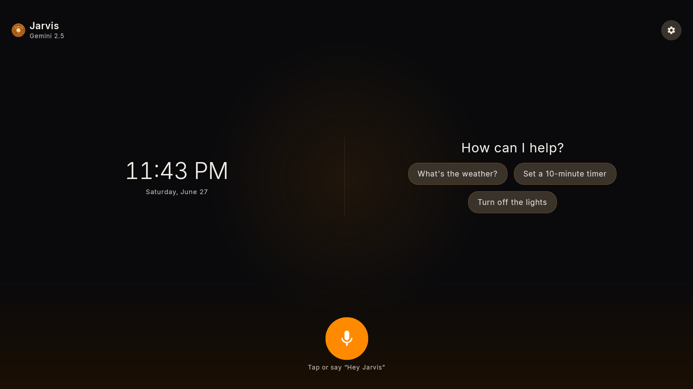
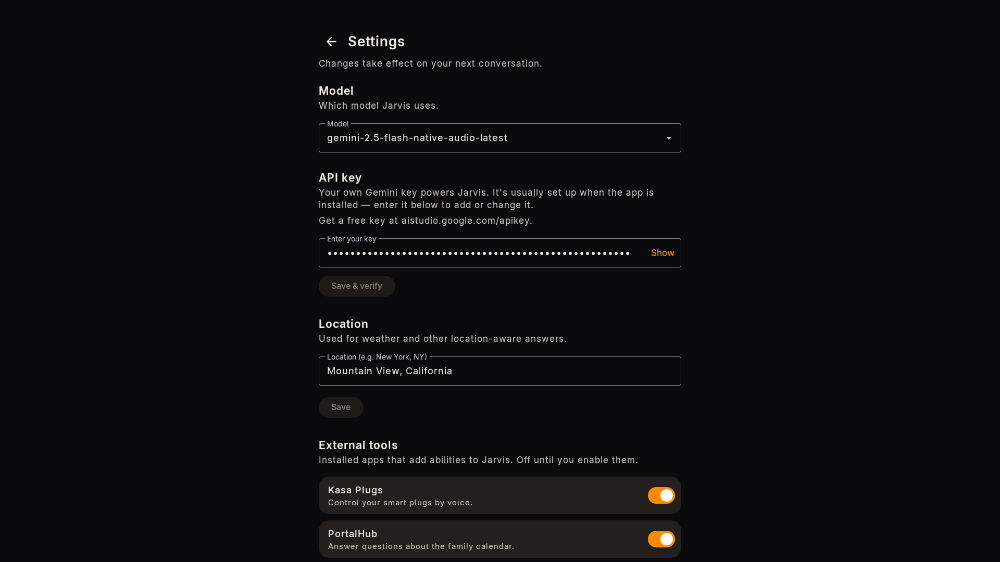
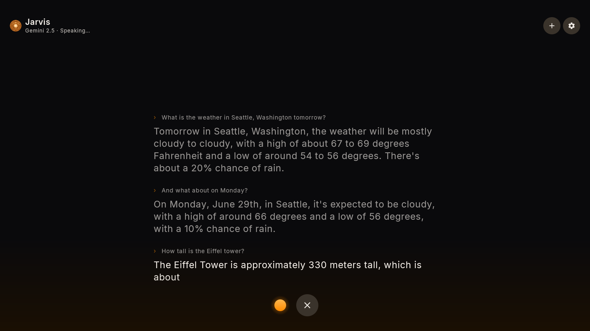

# Portal-Assistant

**Jarvis** is a hands-free conversational AI assistant for the Meta Portal+, powered by the Gemini Live
API. You talk to it in plain language and it answers out loud in a natural voice — looking things up on the
web, controlling the device, and opening apps for you. It runs as **background voice**: the answer plays
through the speaker with just a small orange bar over whatever's on screen (no takeover). Open the app and
you also get a **live on-screen chat** of the conversation.

The AI model is a swappable seam, not the app's identity — "Jarvis" is the assistant; Gemini is what
currently powers it.

<p align="center">
  <a href="https://buymeacoffee.com/linuxbarista"></a>
</p>

### Screenshots

<table>
  <tr>
    <td width="50%"><br><sub><b>Home</b> — greeting and suggestions</sub></td>
    <td width="50%"><br><sub><b>Settings</b> — preferences and enable 3rd-party apps</sub></td>
  </tr>
  <tr>
    <td colspan="2"><br><sub><b>Conversation</b> — multi-turn conversation with the assistant</sub></td>
  </tr>
</table>

## Install it on your Portal (no build required)

You don't need Android Studio or the command line. Grab the latest release, plug the Portal into your
computer with USB‑C, and double‑click one installer:

- **macOS:** `Install-Jarvis.command`
- **Windows:** `Install-Jarvis.bat`

It downloads `adb` if needed, installs Jarvis, grants its permissions, **prompts you to paste your free
Google Gemini API key** (create one at <https://aistudio.google.com/apikey>), and starts it. Full
step‑by‑step instructions — including how the API key works and how to change it later — are in
[`provisioning/README.md`](provisioning/README.md).

> **You bring your own Gemini API key.** It's free, it stays only on your Portal, and Jarvis can't answer
> without one. You can install without it and add it later in **Settings → API key**, but it won't work
> until you do. Hands‑free **"hey jarvis"** works on its own on **Gen 2** (Android 10) while Jarvis is on
> screen; on **Gen 1** (Android 9) it needs the companion **portal-wake** app — details under
> [Talking to it](#talking-to-it).

Developers building from source: see the build/run notes in `CLAUDE.md` and use `./setup.sh`.

## Talking to it

- **"Hey Jarvis, …"** — hands-free wake. Where it works depends on the Portal's Android version:

  | Scenario | Wake path |
  |---|---|
  | **Gen 1** (Android 9), any state | the companion **`portal-wake`** app (background) |
  | **Gen 2** (Android 10), app open | Jarvis's **own foreground** detector — no `portal-wake` needed |
  | **Gen 2**, app in background | *no hands-free wake* (Android 10 silences a background mic) — tap **Tap to talk** |

  So on Gen 1 install `portal-wake` for hands-free anywhere; on Gen 2 hands-free works whenever Jarvis is on
  screen, and you tap to talk when it isn't.
- **Tap to talk** — open the app and tap to start a turn directly, on any setup.
- **Multi-turn** — after each answer Jarvis keeps listening for a follow-up; the conversation ends on its
  own when you stop talking. No need to repeat the wake word for each question.
- **Knows where and when it is** — every conversation is pre-loaded with the device's local
  time/timezone and approximate location, so "what time is it?", "what's the weather?", and "what's near
  me?" just work without you stating where or when you are.

## What it can do

| Feature | Say something like |
| --- | --- |
| **Ask anything** (web-grounded) | "What's the weather?", "Who won last night?", "How long to boil an egg?" |
| **Time & date** | "What time is it?", "What's the date next Friday?" |
| **Timers** | "Set a 10-minute timer for the pasta", "How long left on the pasta?", "Cancel it" |
| **Volume** | "Turn it up", "Set volume to 30%", "Mute", "Unmute" |
| **Brightness** | "Dim the screen", "Brightness to 60%", "Make it brighter" |
| **Do Not Disturb** | "Turn on do not disturb", "Is do not disturb on?" |
| **Media** | "Play Bohemian Rhapsody", "Play some jazz on TIDAL", "Pause", "Next track", "What's playing?" |
| **Open apps** | "Open Spotify", "Open the calendar", "Open the camera" |

Answers that need current information (weather, news, scores, prices, hours) are grounded with Google
Search. Device actions run on-device via Gemini function-calling.

**Music plays on your app of choice.** Jarvis discovers the music apps installed on your Portal (Spotify,
TIDAL, Apple Music…) — pick your favorite as the default in **Settings → Default music app**, and just say
"play some jazz". Name an app any time to override it for one request ("play Zanarkand on TIDAL"). If an app
can't start a search directly, Jarvis opens it for you and says so.

## Plugins — adding a tool without touching this app

Jarvis can call tools that live in **other native apps**. Any installed app can teach Jarvis a new
capability — "turn on the kitchen lights", "arm the alarm", "start the robot vacuum" — without forking or
rebuilding this one. Jarvis discovers tool-provider apps at runtime; you just install one and switch it on.

The contract is the public `ToolContract`: where wake
plugins add a "hey X", tool providers add **function-calling tools**. A provider app does **not** need to
depend on this repo — the literal strings below *are* the contract.

**1. Declare an exported `ContentProvider`** carrying two meta-data strings: `com.portal.assistant.tools`,
a JSON array of LLM tool declarations (the same OpenAPI subset the built-in tools use), and
`com.portal.assistant.tools.summary`, a required one-sentence summary shown in Settings:

```xml
<provider
    android:name=".KasaToolProvider"
    android:authorities="com.example.kasa.tools"
    android:exported="true">
    <!-- value may be an @string/ resource; PackageManager resolves it to the text. -->
    <meta-data android:name="com.portal.assistant.tools" android:value="@string/portal_tools" />
    <!-- required: one human sentence shown under the app name in Settings → External tools. -->
    <meta-data android:name="com.portal.assistant.tools.summary" android:value="@string/portal_tools_summary" />
</provider>
```

```jsonc
// @string/portal_tools — a JSON array of declarations
[
  {
    "name": "com.example.kasa.set_light",          // reverse-domain; must NOT start with "portal."
    "description": "Turn a named smart light on or off.",   // required, non-blank — sent to the model
    "parameters": {                                 // required — an OpenAPI-style object schema
      "type": "object",
      "properties": {
        "room":  { "type": "string", "description": "Which light, e.g. 'kitchen'." },
        "on":    { "type": "boolean", "description": "true = on, false = off." }
      },
      "required": ["room", "on"]
    }
  }
]
```

**2. Answer the invoke.** When the model calls your tool, Jarvis does a synchronous
`ContentResolver.call()` on your authority: method `"invoke"`, `arg` = the tool name, extras carry the
call args as a JSON string (`com.portal.assistant.tools.extra.ARGS`). Return a `Bundle` with the result as
a JSON string (`com.portal.assistant.tools.extra.RESULT`) — that's what the model speaks back. Keep it
fast: the call is timed out after a few seconds, so a slow tool blocks the conversation. Defer heavy work
to a worker and return an ack.

**Rules the assistant enforces** (so a bad or hostile provider can't misbehave):

- **Namespace** — tool names are reverse-domain (`com.example.kasa.set_light`) and **must not** start with
  `portal.`; that's reserved for built-ins, which always win a name collision.
- **Shape** — a declaration missing a non-blank `description` or a `parameters` object is dropped, so the
  model never sees junk.
- **Summary** — the `com.portal.assistant.tools.summary` sentence is required; a provider that omits it is
  hidden from Settings, its tools are **not declared**, and it gets no system-prompt bullet — there is no
  fallback to the per-tool descriptions.
- **Opt-in** — discovery alone grants nothing. Every provider is **off by default**; the user enables it in
  **Settings → External tools**, where each provider shows its one-sentence summary under the app name.

That's the whole surface. Build a provider once, install it next to Jarvis, toggle it on — and the new
capability is available by voice on the next conversation.

## Disclaimer

Portal-Assistant ("Jarvis") is an independent community project — **not affiliated with, endorsed by, or
sponsored by Meta or Google**. "Meta Portal" and "Portal" are trademarks of Meta Platforms, Inc., and
"Gemini" is a trademark of Google LLC, used here only to identify compatible hardware and the AI service it
talks to. It is a sideloaded app for discontinued devices and is **use-at-your-own-risk** (may void
warranty; no guarantees). Jarvis is **not** on-device only: to answer you it streams
your microphone audio to **Google's Gemini Live API** under **your own** API key, subject to Google's terms
and privacy policy. See [DISCLAIMER.md](DISCLAIMER.md) for the full text and privacy notes.
